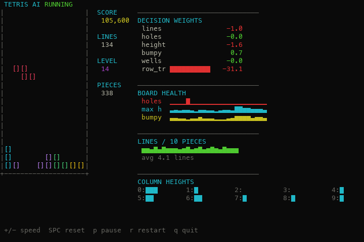

# Tetris AI

A self-playing Tetris AI. It evaluates every placement of the current **and** next
piece (2-ply search) and picks the one that scores best under a weighted set of board
features. The feature weights can be **hand-tuned** or **learned from scratch** by a
genetic algorithm via self-play.

A pure-`curses` terminal app with Unicode sparkline analytics.



---

## How the AI works

For every spawned piece the AI:

1. generates all rotations of the piece,
2. tries every column, hard-dropping to the landing row,
3. repeats steps 1–2 for the **next** piece (2-ply lookahead),
4. scores each resulting board, and
5. plays the move that leads to the best score.

The score is a weighted sum of board features:

| Feature | What it measures |
|---|---|
| Lines cleared | rows completed by the move (reward) |
| Holes | empty cells with a block above them |
| Aggregate height | sum of column heights |
| Bumpiness | roughness of the surface |
| Wells | deep single-column gaps |
| Row / column transitions | filled↔empty flips (fragmentation) |
| Max height | tallest column |
| Landing height | how high the piece landed |

That's ~2,700 board states evaluated per move (~2 ms in Python).

### Is it "machine learning"?

Out of the box the AI uses **hand-tuned** weights (a Dellacherie-style heuristic) — that's
a search algorithm, not learning. The actual ML lives in **`train.py`**, which *learns*
the weights from nothing but self-play results (see below). Both share the same engine;
only the weights differ.

---

## Learning the weights — `train.py`

`train.py` runs a **genetic algorithm**: a population of random weight vectors plays
headless games, the best-scoring ones (by lines cleared before topping out) are bred via
tournament selection, uniform crossover and annealed Gaussian mutation, and the cycle
repeats. No gradients, no labels — black-box optimization, which is the standard,
well-suited method for tuning Tetris heuristics.

```bash
cd terminal
python3 train.py                                   # ~1–2 min on 8 cores
python3 train.py --generations 40 --population 60 --pieces 500
python3 train.py --resume                          # continue from weights.json
```

### Trains automatically while you play

Launching the game (`tetris_ai.py`) starts a trainer in the background, and the running
game **hot-reloads** the improving `weights.json` every few seconds — so you watch the AI
get smarter live (the UI shows `learning · gen N`). It uses half your CPU cores to stay
responsive, stops when you quit, and is disabled with `TETRIS_NO_TRAIN=1`.

The best vector is written to **`weights.json`**, which the game loads automatically.
Sample run:

```
gen  0  best   137.8  mean    92.5   *saved
gen  9  best   139.0  mean   118.5   *saved
gen 24  best   138.8  mean   137.5

Benchmark (1000 pieces, unseen seeds):
  hand-tuned     397.8 lines
  learned        397.0 lines
```

The population mean climbs from 92 → 137 as topping-out is bred out. The learned vector
ties the expert hand-tuned baseline (~398 lines, 0 topouts over 3,000 pieces) — it
**rediscovered competent play from scratch**, landing on a genuinely different strategy
(it leans heavily on column transitions and even found a positive bumpiness weight).

---

## Terminal front-end — `terminal/tetris_ai.py`

A pure-`curses` UI with Unicode sparkline analytics — board-health trends, decision-weight
bars, candidate quality, line-clear rate, and a live column-height profile.

## Quick start

```bash
# play (needs ~80×30 terminal)
python3 terminal/tetris_ai.py

# learn your own weights
python3 terminal/train.py
```

No dependencies — only the Python standard library. Regenerating the screenshot needs
`pillow`.

## Controls

| Key | Action |
|---|---|
| `+` / `-` | speed up / down |
| `Space` | reset speed |
| `p` | pause / resume |
| `r` | restart |
| `q` | quit |

## Project layout

```
terminal/                 # the curses game (run tetris_ai.py here)
  tetris_ai.py            #   engine + curses UI with sparkline analytics
  train.py               #   genetic algorithm — learns weights via self-play
  autotrain.py           #   starts/stops background training on launch
  weights.json           #   learned weights (auto-loaded + hot-reloaded)

generate_screenshots.py   # renders the image in screenshots/ (imports terminal/ engine)
screenshots/              # README image
```

## License

MIT
